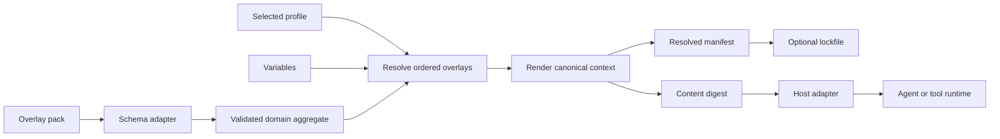

# Architecture

## Mental model

Invokrum treats prompt composition as a deterministic build pipeline:

```text
pack + profile + variables + overlay files
                    │
                    ▼
          parse and normalize
                    │
                    ▼
       validate structure and rules
                    │
                    ▼
        resolve canonical ordering
                    │
                    ▼
       render canonical prompt bytes
                    │
                    ▼
 manifest + digests + optional lockfile
```

The engine validates declared structure and integrity. It does not execute agents, authorize actions, or decide whether prompt text is semantically trustworthy.

## Dependency direction

```text
invokrum-cli / host adapters
              ↓
       invokrum-schema
              ↓
        invokrum-core
```

Dependencies point inward. The core domain has no filesystem, process, network, environment, clock, randomness, or serialization dependency.

## Component boundaries

### `invokrum-core`

Owns the policy-neutral domain and operations:

- validated pack, class, overlay, profile, and variable types;
- deterministic aggregate normalization;
- structural and compatibility invariants;
- deterministic profile resolution and rendering inputs;
- canonical manifests and digest inputs;
- stable domain error categories.

It must not depend on Serde, YAML/JSON libraries, Anthesis, or any host runtime.

### `invokrum-schema`

Owns format-adapter concerns:

- strict YAML and JSON DTOs;
- schema-family negotiation;
- unknown-field rejection;
- DTO-to-domain translation;
- deterministic normalized JSON encoding;
- machine-readable JSON Schema alignment.

It depends on `invokrum-core`; the core must never depend on it. It performs no filesystem access and does not own domain policy.

### `invokrum-cli`

Owns operator-facing concerns:

- argument parsing;
- human-readable diagnostics;
- stable JSON envelopes;
- exit-code mapping;
- filesystem entrypoints;
- stdout/stderr discipline;
- composition-root wiring of concrete adapters.

CLI presentation must not become the integration API for host adapters.

### Consumer packs

Consumers own:

- class names and authority order;
- overlay content;
- profiles and defaults;
- compatibility policy;
- domain-specific governance semantics.

### Host adapters

Hosts own:

- pack acquisition and trust decisions;
- authorization and approvals;
- agent/model/tool invocation;
- sandboxing and network policy;
- evidence persistence;
- binding the resolved digest to an execution.

The security ownership and trust boundaries for these components are normative in the [threat model](../security/threat-model.md).

## Core invariants

1. Identical normalized inputs produce identical output and diagnostic ordering.
2. Ordering never depends on filesystem enumeration or hash-map iteration.
3. Unsupported schema versions and unknown rule kinds fail closed.
4. Composition performs no implicit network access.
5. Paths use a platform-independent lexical grammar and resolve inside a canonical pack root or fail.
6. Sensitive variables are not persisted by default.
7. Human output and machine output remain separate contracts.
8. A host cannot claim Invokrum verification after changing rendered bytes.

Security invariants that are not yet implemented are requirements, not guarantees. Their current control status is tracked in the [threat and control matrix](../security/threat-model.md#threat-and-control-status-matrix).

## Data flow



## Error model

Public errors should be categorized rather than exposing parser-library internals:

- input or syntax error;
- unsupported version;
- invalid schema;
- missing reference;
- path-policy violation;
- cardinality violation;
- compatibility violation;
- ambiguous resolution;
- rendering failure;
- verification mismatch;
- internal invariant failure.

Machine-readable errors should include stable codes, relevant paths, rule identifiers, and ordered diagnostics while avoiding secret values.

## Compatibility surfaces

The following are compatibility-sensitive and require explicit versioning or release notes:

- pack schema;
- normalized manifest format;
- lockfile format;
- JSON CLI output;
- exit codes;
- canonicalization rules;
- public Rust API;
- adapter request and response envelopes.

Human-readable CLI wording is not intended as a stable parsing contract.

## Security architecture

The accepted [threat model and trust boundaries](../security/threat-model.md) define:

- assets, actors, assumptions, and entry points;
- acquisition, filesystem, serialization, domain, variable, and host/runtime boundaries;
- abuse cases and required mitigations;
- implemented, partial, planned, delegated, and out-of-scope controls;
- responsibilities assigned to Invokrum, pack authors, operators, and hosts.

Structural validation never implies semantic prompt safety. Exact-byte integrity never implies authorization or safe runtime behavior.

## Decisions

Architecture decisions are recorded in this directory. The foundational mechanism-versus-policy boundary is defined in [ADR-0001](ADR-0001-mechanism-policy-boundary.md). Clean Architecture, SOLID, dependency injection, and pattern constraints are defined in [clean-solid-and-dependency-injection.md](clean-solid-and-dependency-injection.md). Security claims and trust ownership are defined in the [threat model](../security/threat-model.md).
