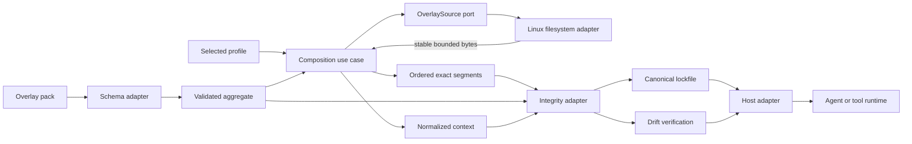

# Architecture

## Mental model

Invokrum treats prompt composition as a deterministic build pipeline:

```text
pack + profile + overlay files
                    │
                    ▼
          parse and normalize
                    │
                    ▼
       validate structure and rules
                    │
                    ▼
        resolve canonical ordering
                    │
                    ▼
       load stable bounded bytes
                    │
                    ▼
 normalized context + resolved manifest
                    │
                    ▼
 canonical evidence + versioned lockfile
```

The engine validates declared structure and integrity. It does not execute agents, authorize actions, authenticate publishers, or decide whether prompt text is semantically trustworthy.

## Dependency direction

```text
invokrum-cli / host adapters
       ↓          ↓          ↓
 schema adapter  fs adapter  integrity adapter
       └──────────┴──────────┘
                  ↓
           invokrum-core
```

Dependencies point inward. The core domain and application composition use case have no filesystem, process, network, environment, clock, randomness, hashing, or serialization dependency.

## Component boundaries

### `invokrum-core`

Owns parsing-neutral domain values, deterministic aggregate validation, compatibility rules, the application-owned `OverlaySource` port, deterministic composition, resource limits, ordered exact-byte segments, normalized context bytes, resolved manifest values, and stable operation errors.

It must not depend on Serde, YAML/JSON libraries, filesystem implementations, hashing implementations, Anthesis, or a host runtime. Composition is tested with in-memory adapters.

### `invokrum-schema`

Owns strict YAML/JSON decoding, schema-family negotiation, duplicate and unknown-field rejection, the accepted YAML subset, DTO translation, normalized JSON, and JSON Schema alignment. It depends inward on `invokrum-core` and performs no filesystem access.

### `invokrum-fs`

Implements `OverlaySource` for local Linux files. It establishes and pins a canonical root, rejects links and filesystem device changes, verifies opened-file containment and identity, and returns bytes from one bounded stable read. Same-device bind mounts are excluded by the documented host namespace precondition rather than claimed as automatically detectable. The adapter depends inward on `invokrum-core` and does not parse schemas or select overlays.

The exact platform and namespace contract is documented in [deterministic composition and filesystem contract](../composition-and-filesystem.md).

### `invokrum-integrity`

Consumes validated pack values and exact composition bytes. It owns versioned canonical JSON evidence, SHA-256 calculation, lockfile decoding, internal digest validation, and deterministic drift classification.

It depends inward on `invokrum-core`, does not reopen source paths, and does not depend on the schema or filesystem adapters. Its manifest digest detects corruption and inconsistency; it is not a publisher signature or authorization claim.

The exact format and digest domains are documented in [integrity, canonical manifests, and lockfiles](../integrity-and-lockfiles.md).

### `invokrum-cli`

Owns arguments, human diagnostics, JSON envelopes, exit codes, atomic output policy, and composition-root wiring of schema, filesystem, integrity, and core behavior. CLI presentation is not the host integration API.

### Consumer packs

Consumers own class names and authority order, overlay content, profiles, compatibility declarations, and domain-specific governance semantics.

### Host adapters

Hosts own pack acquisition and trust, a stable filesystem namespace without same-device bind aliases below the selected root, a protected root parent, publisher authentication, authorization, runtime sandboxing, evidence persistence, and binding exact resolved bytes to execution.

## Core invariants

1. Identical normalized inputs and source bytes produce identical output and diagnostic ordering.
2. Ordering never depends on filesystem enumeration or hash-map iteration.
3. Unsupported schema, lockfile, canonicalization, and digest identifiers fail closed.
4. Composition performs no implicit network access.
5. Paths use a platform-independent lexical grammar and resolve inside a canonical pack root or fail.
6. Composition consumes exact bytes returned by one source read and never reopens paths.
7. Overlay prose cannot redefine structural authority represented by ordered segments.
8. Canonical evidence identifies its format and digest domains.
9. Secret variable values are excluded from persistent evidence by default.
10. Human and machine output remain separate contracts.
11. A host cannot claim verification after changing represented bytes.

Unimplemented security invariants remain requirements rather than guarantees. Current status is tracked in the [threat matrix](../security/threat-model.md#threat-and-control-status-matrix).

## Data flow



## Error model

Public errors use stable categories instead of parser-library or operating-system text. Structured errors may retain validated paths; human delivery output must escape attacker-controlled values or omit them. Application source diagnostics currently omit paths. Integrity errors distinguish malformed or unsupported lock material from repository drift.

## Compatibility surfaces

Compatibility-sensitive surfaces include the pack schema, normalized context framing, canonicalization identifier, digest domains, lockfile format, drift categories, JSON CLI output, exit codes, filesystem policy, public Rust API, and adapter envelopes.

## Security architecture

The accepted [threat model and trust boundaries](../security/threat-model.md) define assets, actors, entry points, boundaries, abuse cases, control status, and responsibility ownership. Structural validation is not semantic prompt approval, exact-byte integrity is not publisher authentication, and verification is not runtime authorization.

## Decisions

Architecture decisions are recorded in this directory. [ADR-0001](ADR-0001-mechanism-policy-boundary.md) defines the mechanism/policy boundary. [Clean Architecture, SOLID, dependency injection, and patterns](clean-solid-and-dependency-injection.md) define implementation constraints.
