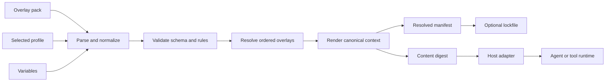

# Architecture

## Mental model

Invokrum treats prompt composition as a deterministic build pipeline:

```text
pack + profile + variables + overlay files
                    │
                    ▼
          parse and normalize
                    │
                    ▼
       validate structure and rules
                    │
                    ▼
        resolve canonical ordering
                    │
                    ▼
       render canonical prompt bytes
                    │
                    ▼
 manifest + digests + optional lockfile
```

The engine validates declared structure and integrity. It does not execute agents, authorize actions, or decide whether the prompt text is semantically trustworthy.

## Component boundaries

### `invokrum-core`

Owns the policy-neutral domain and operations:

- normalized pack, class, overlay, profile, and rule types;
- deterministic profile resolution;
- structural and compatibility validation;
- canonical rendering;
- canonical manifests and digest inputs;
- stable error categories.

It must not depend on Anthesis or any host runtime.

### `invokrum-cli`

Owns operator-facing concerns:

- argument parsing;
- human-readable diagnostics;
- stable JSON envelopes;
- exit-code mapping;
- filesystem entrypoints;
- stdout/stderr discipline.

CLI presentation must not become the integration API for host adapters.

### Consumer packs

Consumers own:

- class names and authority order;
- overlay content;
- profiles and defaults;
- compatibility policy;
- domain-specific governance semantics.

### Host adapters

Hosts own:

- pack acquisition and trust decisions;
- authorization and approvals;
- agent/model/tool invocation;
- sandboxing and network policy;
- evidence persistence;
- binding the resolved digest to an execution.

## Core invariants

1. Identical normalized inputs produce identical output and diagnostic ordering.
2. Ordering never depends on filesystem enumeration or hash-map iteration.
3. Unsupported schema versions and unknown rule kinds fail closed.
4. Composition performs no implicit network access.
5. Paths resolve inside a canonical pack root or fail.
6. Sensitive variables are not persisted by default.
7. Human output and machine output remain separate contracts.
8. A host cannot claim Invokrum verification after changing the rendered bytes.

## Data flow



## Error model

Public errors should be categorized rather than exposing parser-library internals:

- input or syntax error;
- unsupported version;
- invalid schema;
- missing reference;
- path-policy violation;
- cardinality violation;
- compatibility violation;
- ambiguous resolution;
- rendering failure;
- verification mismatch;
- internal invariant failure.

Machine-readable errors should include stable codes, relevant paths, rule identifiers, and ordered diagnostics while avoiding secret values.

## Compatibility surfaces

The following are compatibility-sensitive and require explicit versioning or release notes:

- pack schema;
- normalized manifest format;
- lockfile format;
- JSON CLI output;
- exit codes;
- canonicalization rules;
- public Rust API;
- adapter request and response envelopes.

Human-readable CLI wording is not intended as a stable parsing contract.

## Decisions

Architecture decisions are recorded in this directory. The foundational mechanism-versus-policy boundary is defined in [ADR-0001](ADR-0001-mechanism-policy-boundary.md).