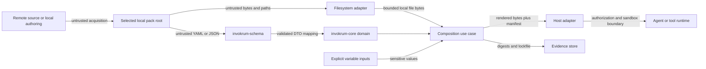

# Threat model and trust boundaries

**Status:** Accepted security architecture for the v0.1 implementation line  
**Scope:** Local YAML/JSON overlay packs, local overlay files, deterministic composition, manifests, digests, lockfiles, CLI adapters, and host integrations  
**Review trigger:** Any change to schema, path resolution, rendering, hashing, persistence, remote acquisition, plugins, host adapters, or secret handling

Invokrum treats pack metadata and overlay content as untrusted input. Validation can establish structural consistency, deterministic resolution, and byte-level integrity. It cannot establish that prompt text is truthful, non-malicious, authorized, or safe for a particular model or tool runtime.

## Security objectives

Invokrum should:

1. reject malformed, ambiguous, unsupported, or structurally inconsistent packs;
2. resolve local inputs deterministically without implicit network access;
3. prevent declared paths from escaping the selected pack root;
4. preserve exact input and output identities for manifests, digests, and lockfiles;
5. avoid leaking sensitive variable values through diagnostics or persisted evidence;
6. make the boundary between Invokrum guarantees and host responsibilities explicit;
7. fail closed when a required security decision is unknown or cannot be verified.

Invokrum does not attempt to:

- determine whether overlay prose is semantically safe or free from prompt injection;
- authorize users, packs, models, tools, or actions;
- sandbox an agent or tool runtime;
- authenticate a pack publisher unless a future acquisition component explicitly implements that policy;
- guarantee model behavior after composition;
- preserve an attestation after a host modifies the rendered bytes.

## Assets

- Pack metadata, schema family, identifiers, classes, overlays, profiles, and variables.
- Overlay source files and their exact bytes.
- Selected profile and caller-supplied variable values.
- Sensitive variable values and any derived rendered content.
- Canonical ordering and normalized resolution results.
- Rendered context bytes.
- Manifests, digests, lockfiles, diagnostics, and exit status.
- Host claims that a particular execution used a verified Invokrum result.
- Repository release artifacts, dependency lockfiles, and published schemas.

## Actors

- **Pack author:** defines metadata, content, profiles, and compatibility declarations.
- **Operator:** chooses a pack, profile, variables, command, and output destination.
- **Host integrator:** acquires packs, wires adapters, enforces authorization, and invokes a runtime.
- **Agent or tool runtime:** consumes rendered context and may have capabilities outside Invokrum.
- **Local attacker:** can influence files, symlinks, environment, process timing, or output destinations.
- **Supply-chain attacker:** can compromise a dependency, release artifact, package registry, or pack source.
- **Malicious pack publisher:** intentionally supplies structurally valid but harmful prompt content.

## Trust boundaries

### Boundary A — acquisition to local pack root

A downloaded or copied pack is untrusted. Invokrum v0.1 composition performs no acquisition and no implicit network access. The host owns source authentication, transport security, signature policy, pinning, quarantine, and update decisions.

### Boundary B — local filesystem to filesystem adapter

Pack paths are attacker-controlled. The filesystem adapter must establish one canonical pack root, apply an explicit symlink policy, reject root escapes and non-regular files, and avoid check-then-use ambiguity. Lexical validation alone is not a filesystem containment guarantee.

### Boundary C — serialized document to schema adapter

YAML and JSON are attacker-controlled. The schema adapter owns syntax decoding, schema-family negotiation, unknown-field rejection, duplicate handling, bounded format behavior, and translation into validated domain values.

### Boundary D — schema adapter to core domain

Only validated value objects and aggregates cross into the core. The core owns deterministic ordering, references, class membership, cardinality, compatibility invariants, and stable domain failures. It does not perform I/O or parse external formats.

### Boundary E — explicit variables to composition

Variable values are caller-controlled and may be sensitive. They must not be read from ambient environment state inside domain or application logic. Sensitive values require redaction and must not be written to manifests or lockfiles unless a future explicit contract permits it.

### Boundary F — rendered result to host and runtime

Rendered prompt content remains untrusted text. The host owns authorization, model/tool selection, sandboxing, capability limits, network policy, approval gates, evidence retention, and binding the exact rendered digest to the execution. Any byte transformation after composition invalidates the original digest claim.

## Assumptions

- The operating system, Rust runtime, and cryptographic primitives used by future hashing work are not already compromised.
- The caller can identify the intended local pack root.
- Invokrum receives explicit inputs rather than relying on mutable ambient state.
- Hosts do not treat structural validation as semantic approval.
- Released binaries and schemas are obtained through a channel whose trust policy is defined by the operator or host.
- Security controls marked **Planned** or **Partial** are not production guarantees.

## Threat and control status matrix

Status meanings:

- **Implemented:** present and covered by executable validation.
- **Partial:** some prerequisite controls exist, but the complete threat is not mitigated.
- **Planned:** accepted requirement without a complete implementation.
- **Delegated:** explicitly owned by a pack author, operator, or host integration.
- **Out of scope:** not a security property Invokrum claims to provide.

| ID | Threat or abuse case | Status | Current control or boundary | Owner / follow-up |
| --- | --- | --- | --- | --- |
| T01 | Malformed documents, unknown fields, or unsupported schema families create ambiguous interpretation. | Implemented | Strict v1 YAML/JSON DTOs, unknown-field rejection, schema-family preflight, JSON Schema and fixtures. | `invokrum-schema`; regression CI. |
| T02 | Duplicate, dangling, wrong-class, or cardinality-invalid selections bypass structural policy. | Implemented | Validated domain value objects and aggregate construction reject invalid references and counts. | `invokrum-core`; unit and integration tests. |
| T03 | Nondeterministic map, set, declaration, or filesystem ordering changes output or diagnostics. | Partial | Domain and schema collections normalize deterministically; composition and diagnostic ordering remain to be completed. | Issue #4. |
| T04 | Absolute paths, parent traversal, platform-specific separators, symlinks, or filesystem races escape the pack root. | Partial | Portable lexical path grammar rejects absolute paths, `..`, empty segments, and backslashes; canonical root and symlink enforcement are not implemented. | Issue #4. |
| T05 | A malicious but structurally valid overlay injects instructions or changes model/tool behavior. | Delegated | Invokrum preserves provenance and structure but does not classify prompt semantics. | Pack trust, host approvals, sandboxing, and capability policy. |
| T06 | Mutable remote content or dependency substitution changes a composition without review. | Partial | Composition has no implicit network access; acquisition and publisher verification are outside the current engine. | Host acquisition policy; future signed distribution only by explicit design. |
| T07 | Secret variables leak through diagnostics, manifests, lockfiles, stdout, logs, or crash reports. | Planned | Variable sensitivity is represented in the domain; value interpolation, redaction, and persistence controls are not implemented. | Issues #4, #5, and #9 follow-up tests. |
| T08 | Hash, canonicalization, manifest, or lockfile confusion allows one input/output to be represented as another. | Planned | Compatibility surfaces and exact-byte requirements are documented; hashing and verification are not implemented. | Issue #5. |
| T09 | Pathological nesting, document size, collection size, overlay size, or output expansion causes denial of service. | Partial | Identifiers and numeric schema fields are bounded; aggregate/document/file/output limits are not yet defined. | Issues #4 and #9 follow-up limits. |
| T10 | A host modifies rendered bytes but still claims the original digest or verification result. | Delegated | Architecture requires exact-byte binding and forbids preserving the claim after transformation. | Host integration contract; issue #5 provides digest material. |
| T11 | A host adapter bypasses validation, reinterprets ordering, or invokes a runtime with different inputs. | Delegated | Stable adapter boundaries and composition-root rules are documented; hosts must consume validated outputs without reinterpretation. | Host conformance tests in issues #7 and #12. |
| T12 | Parser, dependency, build, release, or artifact compromise changes behavior. | Partial | Pinned Rust toolchain, Cargo lockfile, strict CI, maintained YAML adapter, and planned audit/release gates. | Issue #8. |
| T13 | Error messages or source locations expose sensitive content or unstable parser internals. | Partial | Domain errors are typed and parser errors are kept behind the schema boundary; structured redacted diagnostics are incomplete. | Issues #4 and #6. |
| T14 | Self-referential, asymmetric, or semantically inconsistent incompatibility declarations produce surprising policy results. | Partial | References and duplicate list values are validated; complete compatibility evaluation and canonical diagnostics remain. | Issue #4. |

## Security invariants

The following requirements are normative. Items not yet implemented remain requirements rather than guarantees.

1. Core and application policy must not perform implicit network access.
2. Inner layers must not read filesystem, process, environment, clock, randomness, or host state directly.
3. Unsupported schema families, unknown v1 fields, and unknown future rule kinds fail closed.
4. Ordering must not depend on hash-map iteration, filesystem enumeration, locale, or platform path semantics.
5. Every file read for composition must be proven to remain inside one canonical pack root under an explicit symlink policy.
6. Composition must operate on one stable set of bytes; detected mutation or ambiguity fails the operation.
7. Sensitive variable values must be explicit inputs, redacted from diagnostics, and excluded from persistent evidence by default.
8. Manifests, digests, and lockfiles must identify their format and canonicalization version.
9. Verification applies only to the exact bytes represented by the digest.
10. Structurally valid prompt content remains untrusted and receives no semantic safety claim.
11. Hosts must not bypass validation or reinterpret canonical ordering while claiming Invokrum verification.
12. Security-relevant limits and failures must be deterministic and testable.

## Abuse cases and required mitigations

### Pack-root escape

An attacker declares `../../secret`, an absolute path, a Windows-style path, or a symlink chain that resolves outside the pack root.

Required behavior: lexical rejection occurs before I/O; the filesystem adapter canonicalizes the root and candidate, applies the documented symlink policy, verifies containment, opens only acceptable regular files, and fails closed on ambiguity or mutation.

### Prompt injection in an approved-looking pack

A pack passes schema and domain validation but contains instructions that manipulate the model or request unsafe tool actions.

Required behavior: Invokrum reports the selected source identity and content digest but does not label the prose safe. Hosts apply publisher trust, human approval, model/tool sandboxing, and capability policy.

### Secret exfiltration through evidence

A sensitive variable is interpolated into rendered content and then copied into a diagnostic, manifest, lockfile, or CI log.

Required behavior: secret values use a dedicated sensitive representation, rendering avoids debug formatting, diagnostics redact values, and persistent evidence records only an explicitly approved non-reversible representation when required.

### Mutable-input race

A file is validated, then replaced before hashing or rendering.

Required behavior: composition uses stable opened bytes or detects metadata/content mutation and fails. Validation, hashing, rendering, and manifest generation must describe the same bytes.

### Canonicalization split

Two platforms or versions normalize the same pack differently but produce an apparently comparable lockfile.

Required behavior: canonicalization rules are versioned, platform-independent, covered by cross-platform fixtures, and included in the lockfile/manifest identity.

### Host attestation laundering

A host receives verified rendered bytes, appends additional instructions, and records the original digest as if it covered the modified prompt.

Required behavior: the integration contract requires binding the digest to exact execution bytes. Transforming hosts must create a new artifact identity and may not preserve the original verification claim.

### Resource exhaustion

A pack uses very large collections, deeply nested YAML, oversized overlays, or expansion-heavy variables.

Required behavior: adapters enforce documented limits before unbounded allocation or output growth. Limit failures use stable categories and do not include attacker-controlled bulk content.

## Responsibility matrix

| Responsibility | Invokrum core / adapters | Pack author or distributor | Host integration |
| --- | --- | --- | --- |
| Schema and structural validity | Enforce | Produce conforming documents | Reject failures |
| Deterministic ordering and compatibility | Enforce | Declare explicit intent | Do not reinterpret |
| Local path containment | Filesystem adapter enforces | Use pack-relative paths | Select trusted root and permissions |
| Pack publisher authenticity | Not currently provided | Sign/publish through chosen process | Authenticate and pin source |
| Prompt semantic safety | Not provided | Review and govern content | Apply approvals and capability policy |
| Secret classification and redaction | Enforce declared handling when implemented | Mark sensitive variables correctly | Supply values securely and protect outputs |
| Runtime authorization and sandboxing | Not provided | N/A | Enforce |
| Exact-byte execution binding | Produce identity material | N/A | Bind digest to actual invocation bytes |
| Audit retention and access control | Produce bounded evidence | N/A | Persist and protect evidence |

## Security claim discipline

Documentation must label security controls as **Implemented**, **Partial**, **Planned**, **Delegated**, or **Out of scope**. A claim may be marked **Implemented** only when an executable check demonstrates the relevant behavior. Adding a threat, changing a trust boundary, or changing a status requires updating this document and the linked implementation issue or test evidence.

## Residual risk

Even after v0.1 controls are implemented, residual risk includes malicious prompt semantics, compromised hosts, compromised dependencies, unsafe model/tool behavior, stolen signing keys, operator error, and vulnerabilities in the operating system or filesystem. Invokrum reduces ambiguity and improves evidence; it does not replace host security architecture.

## Vulnerability reporting

Report suspected vulnerabilities privately as described in [`SECURITY.md`](../../SECURITY.md). Do not include live secrets or confidential third-party pack content in reports or fixtures.
