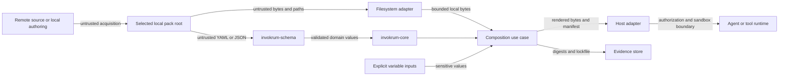

# Threat model and trust boundaries

**Status:** Accepted security architecture for the v0.1 implementation line  
**Scope:** Local YAML/JSON packs, local overlay files, deterministic composition, manifests, digests, lockfiles, CLI adapters, and host integrations  
**Review trigger:** Any change to schema, path resolution, rendering, hashing, persistence, acquisition, plugins, host adapters, or secret handling

Invokrum treats pack metadata and overlay content as untrusted input. Validation can establish structural consistency, deterministic resolution, and byte-level integrity. It cannot establish that prompt text is truthful, non-malicious, authorized, or safe for a particular model or tool runtime.

## Security objectives

Invokrum should:

1. reject malformed, ambiguous, unsupported, or inconsistent packs;
2. resolve local inputs deterministically without implicit network access;
3. prevent declared paths from escaping the selected pack root;
4. preserve exact input and output identities for manifests, digests, and lockfiles;
5. avoid leaking sensitive variable values through diagnostics or persisted evidence;
6. make Invokrum, pack-author, operator, and host responsibilities explicit;
7. fail closed when a required security decision is unknown or unverifiable.

Invokrum does not determine whether overlay prose is semantically safe, authorize users or actions, sandbox runtimes, authenticate publishers, guarantee model behavior, or preserve an attestation after a host modifies rendered bytes.

## Assets

- Pack metadata, schema family, identifiers, classes, overlays, profiles, and variables.
- Overlay files and their exact bytes.
- Selected profile and caller-supplied variable values.
- Sensitive variable values and derived rendered content.
- Canonical ordering and normalized resolution results.
- Rendered context bytes, manifests, digests, lockfiles, diagnostics, and exit status.
- Host claims that an execution used a verified Invokrum result.
- Release artifacts, dependency lockfiles, and published schemas.

## Actors

- **Pack author:** defines metadata, content, profiles, and compatibility declarations.
- **Operator:** chooses a pack, profile, variables, command, and output destination.
- **Host integrator:** acquires packs, wires adapters, authorizes use, and invokes a runtime.
- **Agent or tool runtime:** consumes rendered context and may have external capabilities.
- **Local attacker:** influences files, symlinks, process timing, or output destinations.
- **Supply-chain attacker:** compromises a dependency, artifact, registry, or pack source.
- **Malicious publisher:** supplies structurally valid but harmful prompt content.

## Trust boundaries

### Boundary A — acquisition to local pack root

A downloaded or copied pack is untrusted. V0.1 composition performs no acquisition and no implicit network access. The host owns source authentication, transport security, signature policy, pinning, quarantine, and update decisions.

### Boundary B — filesystem to filesystem adapter

Pack paths are attacker-controlled. The adapter must establish one canonical root, apply an explicit symlink policy, reject escapes and non-regular files, and avoid check-then-use ambiguity. Lexical validation alone is not containment.

### Boundary C — serialized document to schema adapter

YAML and JSON are attacker-controlled. The schema adapter owns syntax decoding, schema-family negotiation, unknown-field rejection, duplicate handling, format limits, and mapping into validated domain values.

### Boundary D — schema adapter to core domain

Only validated value objects and aggregates cross into core. Core owns deterministic ordering, references, class membership, cardinality, compatibility invariants, and stable domain failures. It performs no I/O and parses no external formats.

### Boundary E — variables to composition

Variable values are explicit caller inputs and may be sensitive. Domain and application logic must not read ambient environment state. Sensitive values require redaction and are excluded from persistent evidence by default.

### Boundary F — rendered result to host and runtime

Rendered prompt content remains untrusted text. The host owns authorization, runtime selection, sandboxing, capabilities, network policy, approvals, evidence retention, and binding the exact digest to execution bytes. Any byte transformation invalidates the original digest claim.

## Assumptions

- The operating system, Rust runtime, and future cryptographic primitives are not already compromised.
- The caller can identify the intended local pack root.
- Inputs are explicit rather than read from mutable ambient state.
- Hosts do not treat structural validation as semantic approval.
- Binary and schema acquisition trust is defined by the operator or host.
- Controls marked **Planned** or **Partial** are not production guarantees.

## Threat and control status matrix

Status meanings:

- **Implemented:** present and covered by executable validation.
- **Partial:** prerequisites exist, but the threat is not fully mitigated.
- **Planned:** accepted requirement without a complete implementation.
- **Delegated:** explicitly owned by a pack author, operator, or host.
- **Out of scope:** not a security property Invokrum claims.

| ID | Threat or abuse case | Status | Current control or boundary | Owner / follow-up |
| --- | --- | --- | --- | --- |
| T01 | Malformed documents, unknown fields, or unsupported schema families create ambiguous interpretation. | Implemented | Strict DTOs, unknown-field rejection, schema preflight, JSON Schema, and fixtures. | `invokrum-schema`; regression CI. |
| T02 | Duplicate, dangling, wrong-class, or cardinality-invalid selections bypass structural policy. | Implemented | Validated domain values and aggregate construction reject invalid references and counts. | `invokrum-core`; unit and integration tests. |
| T03 | Nondeterministic declaration, collection, diagnostic, or filesystem ordering changes output. | Partial | Domain and schema collections normalize deterministically; composition remains. | Issue #4. |
| T04 | Absolute paths, traversal, platform separators, symlinks, or races escape the pack root. | Partial | Portable lexical grammar rejects absolute paths, `..`, empty segments, and backslashes. | Issue #4 for canonical root and symlink controls. |
| T05 | A structurally valid overlay injects instructions or changes model/tool behavior. | Delegated | Invokrum preserves provenance and structure but does not classify prompt semantics. | Pack trust, host approvals, sandboxing, and capability policy. |
| T06 | Mutable remote content or substitution changes composition without review. | Partial | Composition has no implicit network access; acquisition is outside the engine. | Host acquisition policy; signed distribution requires explicit future design. |
| T07 | Secret variables leak through diagnostics, manifests, lockfiles, stdout, logs, or crashes. | Planned | Sensitivity is represented; interpolation, redaction, and persistence controls remain. | Issues #4, #5, and #20. |
| T08 | Hash, canonicalization, manifest, or lockfile confusion represents one artifact as another. | Planned | Exact-byte and compatibility requirements are documented; hashing is not implemented. | Issue #5. |
| T09 | Pathological nesting, collection size, file size, or output expansion causes denial of service. | Partial | Identifiers and numeric schema fields are bounded; aggregate/document/file/output limits remain. | Issues #4 and #20. |
| T10 | A host modifies rendered bytes but claims the original digest or verification. | Delegated | Architecture requires exact-byte binding and invalidates claims after transformation. | Host contract; issue #5 provides digest material. |
| T11 | A host bypasses validation, reinterprets ordering, or invokes a runtime with different inputs. | Delegated | Stable adapter boundaries and composition-root rules are documented. | Host conformance work in issues #7 and #12. |
| T12 | Parser, dependency, build, release, or artifact compromise changes behavior. | Partial | Pinned toolchain, Cargo lockfile, strict CI, maintained YAML adapter. | Issue #8 for audits and release gates. |
| T13 | Errors or source locations expose sensitive content or unstable parser internals. | Partial | Domain errors are typed and parser errors stay behind the schema boundary. | Issues #4 and #6 for redacted diagnostics. |
| T14 | Self-referential, asymmetric, or inconsistent incompatibility rules produce surprising results. | Partial | References and duplicate list values are validated; complete evaluation remains. | Issue #4. |

## Security invariants

These requirements are normative. Unimplemented items remain requirements rather than guarantees.

1. Core and application policy perform no implicit network access.
2. Inner layers do not read filesystem, process, environment, clock, randomness, or host state directly.
3. Unsupported schema families, unknown v1 fields, and unknown future rule kinds fail closed.
4. Ordering does not depend on hash-map iteration, filesystem enumeration, locale, or platform path semantics.
5. Every composed file remains inside one canonical root under an explicit symlink policy.
6. Validation, hashing, rendering, and manifests describe the same stable bytes.
7. Sensitive values are explicit, redacted from diagnostics, and excluded from persistent evidence by default.
8. Manifests, digests, and lockfiles identify their format and canonicalization version.
9. Verification applies only to the exact represented bytes.
10. Structurally valid prompt content remains untrusted and receives no semantic safety claim.
11. Hosts do not bypass validation or reinterpret canonical ordering while claiming verification.
12. Security limits and failures are deterministic and testable.

## Abuse cases and required mitigations

### Pack-root escape

An attacker declares `../../secret`, an absolute or Windows-style path, or a symlink chain outside the root. Lexical rejection occurs before I/O; the filesystem adapter must canonicalize root and candidate, enforce symlink policy, verify containment, open acceptable regular files, and fail on ambiguity or mutation.

### Prompt injection in an approved-looking pack

A pack passes structural validation but contains instructions that manipulate a runtime. Invokrum reports source identity and content digest but does not label prose safe. Hosts apply publisher trust, human approval, sandboxing, and capability policy.

### Secret exfiltration through evidence

A sensitive value is interpolated and copied into a diagnostic, manifest, lockfile, or log. Sensitive values require a dedicated representation, redacted diagnostics, safe rendering, and default exclusion from persisted evidence.

### Mutable-input race

A file is validated and then replaced before hashing or rendering. Composition must use stable opened bytes or detect mutation and fail; every resulting artifact describes the same bytes.

### Canonicalization split

Platforms or versions normalize a pack differently but produce comparable-looking evidence. Canonicalization rules must be versioned, platform-independent, tested across fixtures, and included in artifact identity.

### Host attestation laundering

A host appends instructions after verification and records the original digest. Transforming hosts must create a new artifact identity and cannot preserve the original verification claim.

### Resource exhaustion

A pack uses deep YAML, large collections, oversized overlays, or expansion-heavy variables. Adapters must enforce documented limits before unbounded allocation or output growth and return stable errors without bulk attacker content.

## Responsibility matrix

| Responsibility | Invokrum core / adapters | Pack author or distributor | Host integration |
| --- | --- | --- | --- |
| Schema and structural validity | Enforce | Produce conforming documents | Reject failures |
| Deterministic ordering and compatibility | Enforce | Declare explicit intent | Do not reinterpret |
| Local path containment | Filesystem adapter enforces | Use pack-relative paths | Select trusted root and permissions |
| Publisher authenticity | Not currently provided | Sign or publish through chosen process | Authenticate and pin source |
| Prompt semantic safety | Not provided | Review and govern content | Apply approvals and capability policy |
| Secret handling | Enforce declared policy when implemented | Mark variables correctly | Supply values securely and protect outputs |
| Runtime authorization and sandboxing | Not provided | N/A | Enforce |
| Exact-byte execution binding | Produce identity material | N/A | Bind digest to invocation bytes |
| Audit retention and access control | Produce bounded evidence | N/A | Persist and protect evidence |

## Security claim discipline

Documentation labels controls as **Implemented**, **Partial**, **Planned**, **Delegated**, or **Out of scope**. A control may be **Implemented** only when executable validation demonstrates the behavior. Adding a threat, changing a boundary, or changing status requires updating this document and linked issue or test evidence.

## Residual risk

Residual risk includes malicious prompt semantics, compromised hosts or dependencies, unsafe model/tool behavior, stolen signing keys, operator error, and operating-system or filesystem vulnerabilities. Invokrum reduces ambiguity and improves evidence; it does not replace host security architecture.

## Vulnerability reporting

Report suspected vulnerabilities privately as described in [`SECURITY.md`](../../SECURITY.md). Do not include live secrets or confidential third-party content in reports or fixtures.
