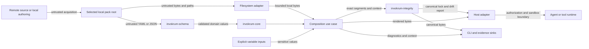

# Threat model and trust boundaries

**Status:** Accepted security architecture for the v0.1 implementation line  
**Scope:** Local YAML/JSON packs, local overlay files, deterministic composition, manifests, digests, lockfiles, CLI adapters, output sinks, and host integrations  
**Review trigger:** Any change to schema, path resolution, rendering, hashing, persistence, acquisition, plugins, host adapters, output handling, or secret handling

Invokrum treats pack metadata and overlay content as untrusted input. Validation can establish structural consistency, deterministic resolution, and byte-level integrity. It cannot establish that prompt text is truthful, non-malicious, authorized, or safe for a particular model or tool runtime.

## Security objectives

Invokrum should:

1. reject malformed, ambiguous, unsupported, or inconsistent packs;
2. resolve local inputs deterministically without implicit network access;
3. prevent declared paths from escaping the selected pack root;
4. preserve exact input and output identities for manifests, digests, and lockfiles;
5. avoid leaking sensitive variable values through diagnostics or persisted evidence;
6. avoid unsafe output replacement, terminal injection, and misleading host claims;
7. make Invokrum, pack-author, operator, and host responsibilities explicit;
8. fail closed when a required security decision is unknown or unverifiable.

Invokrum does not determine whether overlay prose is semantically safe, authorize users or actions, sandbox runtimes, authenticate publishers, guarantee model behavior, or preserve an attestation after a host modifies rendered bytes.

## Assets

- Pack metadata, schema family, identifiers, classes, overlays, profiles, and variables.
- Overlay files and their exact bytes.
- Selected profile and caller-supplied variable values.
- Sensitive variable values and derived rendered content.
- Canonical ordering and normalized resolution results.
- Rendered context bytes, manifests, digests, lockfiles, diagnostics, and exit status.
- Operator-selected output paths and destination permissions.
- Host claims that an execution used a verified Invokrum result.
- Release artifacts, dependency lockfiles, and published schemas.

## Actors

- **Pack author:** defines metadata, content, profiles, and compatibility declarations.
- **Operator:** chooses a pack, profile, variables, command, and output destination.
- **Host integrator:** acquires packs, wires adapters, authorizes use, and invokes a runtime.
- **Agent or tool runtime:** consumes rendered context and may have external capabilities.
- **Local attacker:** influences files, links, process timing, mount namespace, terminal text, or output destinations.
- **Supply-chain attacker:** compromises a dependency, artifact, registry, or pack source.
- **Malicious publisher:** supplies structurally valid but harmful prompt content.

## Entry points

- YAML or JSON pack document bytes supplied by a file, standard input, API, or host adapter.
- Pack root and overlay source paths selected by the operator or declared by the pack.
- Overlay file bytes and filesystem metadata observed during composition.
- Profile identifier and explicit variable values supplied by an operator or host.
- CLI arguments, environment used by the delivery layer, standard input, and working directory.
- Output paths, stdout, stderr, manifests, lockfiles, and host evidence sinks.
- Host-adapter requests and the exact rendered bytes handed to a model or tool runtime.
- Acquired binaries, schemas, dependencies, pack archives, and future plugin artifacts.

## Trust boundaries

### Boundary A — acquisition to local pack root

A downloaded or copied pack is untrusted. V0.1 composition performs no acquisition and no implicit network access. The host owns source authentication, transport security, signature policy, pinning, quarantine, and update decisions.

### Boundary B — filesystem to filesystem adapter

Pack paths and filesystem entries are attacker-controlled. The adapter must establish one canonical root, apply explicit symlink and link policies, reject escapes and unacceptable file types, and avoid check-then-use ambiguity. Lexical validation alone is not containment.

The v0.1 `invokrum-fs` adapter supports Linux only. It rejects symbolic links at every declared component, hard-linked files, non-regular files, device-boundary crossings, canonical root escapes, and changed file identity or metadata. It validates the opened `/proc/self/fd` target and returns bytes from that same opened file. Non-Linux platforms fail closed as unsupported. The detailed contract is documented in [`docs/composition-and-filesystem.md`](../composition-and-filesystem.md).

Canonical containment still cannot prove provenance against a privileged actor that can remap mounts or the namespace during composition. The host must provide a stable mount namespace and protect the selected root from privileged concurrent manipulation.

### Boundary C — serialized document to schema adapter

YAML and JSON are attacker-controlled. The schema adapter owns syntax decoding, schema-family negotiation, unknown-field rejection, duplicate-key behavior, an explicitly accepted YAML feature subset, format limits, and mapping into validated domain values. JSON Schema validation alone cannot detect duplicate object keys after a parser has collapsed them.

The default v1 policy rejects documents over 1 MiB before scanning or deserialization, limits recursive mapping/sequence depth to 32, and bounds class, overlay, profile, variable, selection, and incompatibility declarations before domain aggregate construction. Hosts may inject tighter immutable limits. Raising limits transfers memory and latency risk to the host.

### Boundary D — schema adapter to core domain

Only validated value objects and aggregates cross into core. Core owns deterministic ordering, references, class membership, cardinality, compatibility invariants, and stable domain failures. It performs no I/O and parses no external formats.

### Boundary E — variables to composition

Variable values are explicit caller inputs and may be sensitive. Domain and application logic must not read ambient environment state. Sensitive values require redaction and are excluded from persistent evidence by default.

### Boundary F — composition to integrity adapter

The integrity adapter receives validated pack values plus exact source segments and normalized output bytes. It owns versioned canonical JSON, SHA-256 digest domains, strict bounded lock decoding, internal digest consistency, and ordered drift categories. It does not reopen paths or read ambient state.

V1 lock input is limited to 1 MiB and 256 overlay records. Decoding rejects unknown fields, duplicate known fields, noncanonical JSON bytes, invalid identifiers and source paths, unsupported format or algorithm identifiers, malformed digests, and internally inconsistent manifests.

The unkeyed manifest digest detects corruption and inconsistent edits; it is not a signature or publisher-authentication claim. Anyone able to replace the lock can recompute its unkeyed digests. Trusted distribution, signatures, and source authentication remain host responsibilities.

### Boundary G — rendered result to host and runtime

Rendered prompt content remains untrusted text. The host owns authorization, runtime selection, sandboxing, capabilities, network policy, approvals, evidence retention, and binding the exact digest to execution bytes. Any byte transformation invalidates the original digest claim.

### Boundary H — application and integrity results to CLI and evidence sinks

Output destinations may be attacker-controlled or security-sensitive. The CLI keeps raw context and canonical lock bytes separate from diagnostics, emits versioned machine JSON, visibly encodes control characters in human diagnostics, and writes persistent output through a Linux-only same-directory staging adapter.

The Linux output adapter rejects symbolic-link and non-regular targets, requires explicit replacement, creates mode `0600` staging files, verifies parent and target identity, commits atomically, and cleans temporary or newly linked artifacts after failed no-clobber commits. The host must protect the parent directory and mount namespace from privileged concurrent replacement. A directory-sync failure can leave complete committed bytes whose durability is uncertain; partial staged bytes are never reported as success. Non-Linux persistent output fails closed as unsupported.

## Assumptions

- The operating system, Rust runtime, parser dependencies, and implemented SHA-256 primitive are not already compromised.
- The caller can identify the intended local pack root.
- Linux hosts supply a stable mount namespace for the duration of composition.
- Output parent directories are protected from privileged concurrent replacement.
- Inputs are explicit rather than read from mutable ambient state by inner layers.
- Hosts do not treat structural validation as semantic approval.
- Binary, schema, and pack acquisition trust is defined by the operator or host.
- Controls marked **Planned** or **Partial** are not production guarantees.

## Threat and control status matrix

Status meanings:

- **Implemented:** present and covered by executable validation.
- **Partial:** prerequisites exist, but the threat is not fully mitigated.
- **Planned:** accepted requirement without a complete implementation.
- **Delegated:** explicitly owned by a pack author, operator, or host.
- **Out of scope:** not a security property Invokrum claims.

| ID | Threat or abuse case | Status | Current control or boundary | Owner / follow-up |
| --- | --- | --- | --- | --- |
| T01 | Invalid syntax, unknown v1 fields, or unsupported schema families create ambiguous interpretation. | Implemented | Strict DTOs, unknown-field rejection, bounded schema preflight, JSON Schema, and fixtures. | `invokrum-schema`; regression CI. |
| T02 | Duplicate declarations or selected overlay IDs, dangling references, wrong-class selections, or invalid cardinality bypass structural policy. | Implemented | Validated domain values and aggregate construction reject these states. | `invokrum-core`; unit and integration tests. |
| T03 | Nondeterministic declaration, collection, diagnostic, or filesystem ordering changes output. | Implemented | Domain, schema, composition, canonical lock encoding, drift reports, CLI envelopes, and diagnostics use explicit deterministic ordering and are covered by layered tests. | Regression CI. |
| T04 | Traversal, platform separators, symlinks, hard links, namespace aliases, mount points, reparse points, or races expose unintended bytes. | Partial | Portable lexical validation plus the Linux adapter reject symlinks, hard links, device crossings, root escapes, non-regular files, and changed opened-file identity. Non-Linux platforms fail closed. | Stable host namespace precondition; future platform adapters. |
| T05 | A structurally valid overlay injects instructions or changes model or tool behavior. | Delegated | Invokrum preserves provenance and structure but does not classify prompt semantics. | Pack trust, host approvals, sandboxing, and capability policy. |
| T06 | Mutable remote content or substitution changes composition without review. | Partial | Core, schema, composition, filesystem, integrity, and CLI runtime paths perform no acquisition or implicit network access; lock generation consumes exact local composition bytes. | Host acquisition and publisher-authentication policy. |
| T07 | Secret variables leak through diagnostics, manifests, lockfiles, stdout, logs, or crashes. | Partial | The v1 lock and CLI operations accept no variable values, expose no value field, and omit variable declarations from machine envelopes. Future interpolation still requires dedicated redaction and persistence rules. | Future interpolation design. |
| T08 | Hash, canonicalization, manifest, or lockfile confusion represents one artifact as another. | Implemented | Versioned exact canonical JSON, separated SHA-256 digest domains, strict identity/digest validation, internal engine-input and manifest checks, and deterministic drift categories are executable contracts. | `invokrum-integrity`; integrity regression CI. |
| T09 | Pathological nesting, collection size, file size, lock size, or output expansion causes denial of service. | Implemented | Schema input bytes, container depth, and declaration counts are bounded; composition bounds selected overlays, source bytes, and normalized output; lock decoding bounds input bytes and overlay records. Exact and over-limit behavior is tested. | Hosts must not raise injected limits beyond their resource budget. |
| T10 | A host modifies rendered bytes but claims the original digest or verification. | Delegated | The output digest covers exact normalized bytes and verification reports output drift; a transforming host must create a new identity and bind it to invocation. | Host execution and evidence contract. |
| T11 | A host bypasses validation, reinterprets ordering, or invokes a runtime with different inputs. | Delegated | Stable adapter boundaries and composition-root rules are documented. | Host conformance work in issues #7 and #12. |
| T12 | Parser, dependency, build, release, or artifact compromise changes behavior. | Partial | Pinned Rust toolchain, Cargo lockfile, strict CI, maintained schema dependencies, and published SHA-256 test vectors are present. | Issue #8 for audits, action pinning, and release gates. |
| T13 | Errors or source locations expose sensitive content or unstable parser internals. | Implemented | Errors use stable categories, parser messages and schema identities are bounded, source failures expose validated paths without raw content, and CLI diagnostics visibly encode controls. | Regression CI; revisit with interpolation. |
| T14 | Self-referential, asymmetric, or inconsistent incompatibility rules produce surprising results. | Implemented | References are validated and every selected directional or self-incompatibility declaration is evaluated in deterministic composition order before source reads. | `invokrum-core`; composition regression tests. |
| T15 | Duplicate JSON or YAML mapping keys, aliases, merge keys, tags, or multi-document input create parser-dependent meaning. | Implemented | Schema preflight rejects duplicate keys and unsupported YAML features; lock decoding rejects duplicate fields and requires exact canonical JSON bytes. | Schema and integrity adversarial regression tests. |
| T16 | Attacker-controlled paths or parser messages inject control characters into terminals, logs, or machine-output boundaries. | Implemented | Identifiers are restricted, paths are validated, parser messages are bounded, human diagnostics visibly encode controls, and versioned JSON remains separate from stderr. | CLI and schema E2E regression tests. |
| T17 | Output paths cause clobbering, symlink following, unsafe permissions, partial writes, or stale artifacts after failure. | Partial | The Linux output adapter enforces no-follow regular targets, explicit replacement, mode `0600`, same-directory staging, atomic commit, identity checks, and cleanup. | Protected parent and namespace precondition; future non-Linux adapters and durability handling. |

## Security invariants

These requirements are normative. Unimplemented items remain requirements rather than guarantees.

1. Core and application policy perform no implicit network access.
2. Inner layers do not read filesystem, process, environment, clock, randomness, or host state directly.
3. Unsupported schema, lockfile, canonicalization, and digest identifiers fail closed.
4. Parser-level duplicate keys and unsupported YAML features fail closed before semantic mapping.
5. Ordering does not depend on hash-map iteration, filesystem enumeration, locale, or platform path semantics.
6. Every composed file remains inside one canonical root under an explicit filesystem and link policy.
7. Validation, hashing, rendering, and manifests describe the same stable bytes.
8. Sensitive values are explicit, redacted from diagnostics, and excluded from persistent evidence by default.
9. Manifests, digests, and lockfiles identify their format, canonicalization, and digest algorithm versions.
10. Verification applies only to the exact represented bytes and exact canonical lock encoding.
11. Structurally valid prompt content remains untrusted and receives no semantic safety claim.
12. Hosts do not bypass validation or reinterpret canonical ordering while claiming verification.
13. Human output escapes attacker-controlled control characters; machine output remains valid for its declared encoding.
14. Persistent output uses explicit overwrite, link, permission, atomicity, and failure-cleanup policy.
15. Security limits and failures are deterministic and testable.
16. Unkeyed integrity digests are not represented as publisher authentication or authorization.

## Abuse cases and required mitigations

### Pack-root escape or namespace alias

An attacker declares `../../secret`, an absolute or Windows-style path, a symlink chain, a hard link, or a path below a mount that exposes unintended bytes. Lexical rejection occurs before I/O. On Linux, `invokrum-fs` rejects links, device changes, canonical escapes, non-regular files, and opened-file identity changes. Windows junction and reparse behavior is not approximated; the adapter fails closed as unsupported. A privileged hostile mount namespace remains a host-controlled residual risk.

### Ambiguous serialized input

An attacker repeats a profile-selection key, uses a YAML merge key or alias, supplies multiple YAML documents, or provides a lockfile with reordered or duplicate JSON fields. The schema boundary recursively rejects duplicate mapping keys and excludes parser-expanding YAML features. The integrity boundary rejects duplicate lock fields and any byte stream that is not the exact canonical v1 JSON encoding.

### Prompt injection in an approved-looking pack

A pack passes structural validation but contains instructions that manipulate a runtime. Invokrum reports source identity and content digest but does not label prose safe. Hosts apply publisher trust, human approval, sandboxing, and capability policy.

### Secret exfiltration through evidence

A sensitive value is interpolated and copied into a diagnostic, manifest, lockfile, or log. The v1 lock and CLI APIs cannot accept or persist variable values and do not embed variable declarations in machine output. Future interpolation still requires a dedicated representation, redacted diagnostics, safe rendering, and default exclusion from persisted evidence.

### Mutable-input race

A file is validated and then replaced before hashing or rendering. The Linux adapter compares candidate and opened identity, reads through one open descriptor, verifies the opened target is contained, and compares identity and metadata after reading. Downstream composition and hashing consume the returned bytes rather than reopening the path.

### Canonicalization split

Platforms or versions normalize a pack differently but produce comparable-looking evidence. V1 canonicalization has an explicit identifier, encodes normalized domain collections through ordered structs, and requires decoded bytes to equal canonical re-encoding exactly. A rule change requires a new identifier.

### Lockfile substitution

An attacker replaces a lockfile and recomputes every unkeyed digest. Internal integrity checks cannot authenticate the publisher or storage channel. Hosts that require provenance must authenticate distribution or bind an external signature to the exact canonical lock bytes.

### Terminal or log injection

A path or parser message contains newlines, terminal escapes, or delimiter-like text that forges diagnostics or corrupts downstream parsing. Application source failures expose stable categories and validated paths without raw source content. Schema parser text is bounded. Human CLI diagnostics visibly encode control characters, while versioned JSON output remains syntactically separate from stderr.

### Unsafe output replacement

An output path points through a symlink, names an existing sensitive file, or receives a partial result before composition fails. On Linux, the output adapter rejects links and non-regular targets, requires explicit replacement, stages privately in the destination directory, verifies identities, commits atomically, and cleans failed temporary or newly linked artifacts. The host must protect the parent and namespace. A post-commit directory-sync failure may leave complete bytes with uncertain durability, but partial staged bytes are never reported as success.

### Host attestation laundering

A host appends instructions after verification and records the original digest. Transforming hosts must create a new artifact identity and cannot preserve the original verification claim.

### Resource exhaustion

A pack uses deep nesting, large collections, oversized overlays, expansion-heavy future variables, or oversized lock evidence. The schema adapter rejects documents over 1 MiB by default before deserialization, limits container depth to 32, and bounds every v1 declaration category before domain construction. YAML aliases and block scalars are not accepted. Composition bounds selected overlay count, each source read, and normalized output growth. Lock decoding rejects more than 1 MiB or 256 overlay records before drift evaluation. Hosts injecting larger limits accept the corresponding memory and latency risk.

## Responsibility matrix

| Responsibility | Invokrum core or adapters | Pack author or distributor | Host integration |
| --- | --- | --- | --- |
| Schema and structural validity | Enforce with bounded parsing | Produce conforming documents | Reject failures; choose safe limits |
| Duplicate keys and accepted encodings | Schema and integrity adapters enforce | Avoid unsupported features and noncanonical lock encodings | Do not bypass decoding |
| Deterministic ordering and compatibility | Enforce | Declare explicit intent | Do not reinterpret |
| Local path containment | Linux adapter enforces documented policy | Use pack-relative paths | Select protected root and stable namespace; reject unsupported platforms |
| Canonical lock integrity | Produce and verify versioned bounded evidence | Preserve exact canonical bytes | Authenticate storage/distribution when provenance matters |
| Publisher authenticity | Not provided by unkeyed digests | Sign or publish through chosen process | Authenticate and pin source |
| Prompt semantic safety | Not provided | Review and govern content | Apply approvals and capability policy |
| Secret handling | V1 lock and CLI exclude variable values; future interpolation remains | Mark variables correctly | Supply values securely and protect outputs |
| Runtime authorization and sandboxing | Not provided | N/A | Enforce |
| Output path and terminal safety | Linux CLI adapter enforces supported policy | Avoid hostile names where possible | Select protected destinations and retain securely |
| Exact-byte execution binding | Produce input and output identity material | N/A | Bind digest to invocation bytes |
| Audit retention and access control | Produce bounded evidence | N/A | Persist and protect evidence |

## Security claim discipline

Documentation labels controls as **Implemented**, **Partial**, **Planned**, **Delegated**, or **Out of scope**. A control may be **Implemented** only when executable validation demonstrates the behavior. Adding a threat, changing a boundary, or changing status requires updating this document and linked issue or test evidence.

The threat-model checker validates document structure and status-table integrity. It does not prove that prose accurately describes code; reviewers must verify every **Implemented** claim against executable evidence.

## Residual risk

Residual risk includes malicious prompt semantics, compromised hosts or dependencies, parser implementation vulnerabilities or unexpectedly expensive inputs within configured limits, unsafe model or tool behavior, stolen signing keys, unauthenticated lockfile replacement with recomputed unkeyed digests, operator error, privileged hostile mount namespaces, unsafe host-selected limit increases, unsupported non-Linux filesystem semantics, uncertain durability after a post-commit directory-sync failure, and operating-system or filesystem vulnerabilities. Invokrum reduces ambiguity and improves evidence; it does not replace host security architecture.

## Vulnerability reporting

Report suspected vulnerabilities privately as described in [`SECURITY.md`](../../SECURITY.md). Do not include live secrets or confidential third-party content in reports or fixtures.
